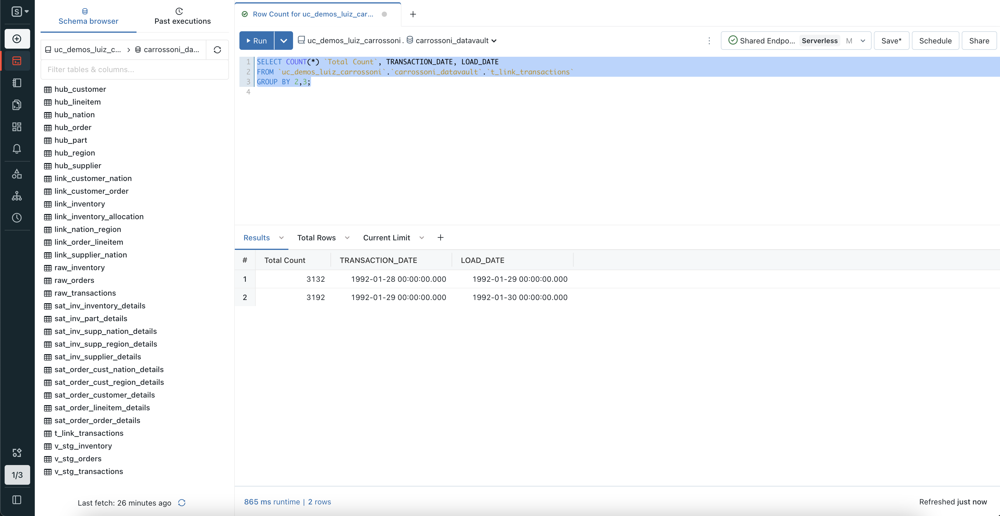

<div align="center">
  
  
</div>

### dbt models for dbtvault Databricks TPC-H example

- [Project Repository](https://github.com/carrossoni/dbvault-databricksDemo)

This is a downloadable example dbt project using [dbtvault](https://github.com/Datavault-UK/dbtvault) to create a Data Vault 2.0 Data Warehouse
based on the [Databricks Sample](https://docs.databricks.com/dbfs/databricks-datasets.html#unity-catalog-datasets) TPC-H dataset in Unity Catalog samples datasets.

This work was inspired by the dbtvault worked example already available in the dbtvault [documentation](https://dbtvault.readthedocs.io/en/latest/).

## Requirements

For this example you will need:

- Databricks workspace access and a personal access token [PAT](https://docs.databricks.com/dev-tools/api/latest/authentication.html#generate-a-personal-access-token)
- A SQL Warehouse  created to serve as endpoint. Needs to get the [HTTP Path](https://docs.databricks.com/integrations/jdbc-odbc-bi.html#get-connection-details-for-a-sql-warehouse) information
- A [Catalog](https://docs.databricks.com/data-governance/unity-catalog/create-catalogs.html) used for Databricks Unity Catalog to store databases with the proper permissions for your user
- A [Schema(database)](https://docs.databricks.com/data-governance/unity-catalog/create-schemas.html) that will be used for this demo with access to create objects (Tables and Views) with the proper permissions for your user
- Python 3.10 (Version tested for this example)
- A utility for creating Python virtual environments (such as [pipenv](https://docs.python-guide.org/dev/virtualenvs/))

## Example project

Create a Datavault 2.0 quickly based on TPC-H model with this example/steps:

### Step 1: Clone this repository

### Step 2: In a terminal execute the following commands to enable the virtual environment for the project:
```bash
# Configure pipenv environment with right Python version
$pipenv --python 3.10

# Install the packages (you can do this also using the requirements.txt)
$pipenv install

# Activate the shell
$pipenv shell
```
---
**Tip**

You can check if your environment is with the right setup by executing python --version and dbt --version.

---
### Step 3: Configure your dbt packages and databricks profile and put the connection/credential information:
```bash
# Configure dbt packages
$dbt deps

# Configure dbt project with Databricks
$dbt init dbtvault-databricksDemo-1.0
 ```
---
**Tip**

Follow the instructions to input the catalog/schema/endpoint url and configure the profile
you can have more information in [this](https://docs.databricks.com/partners/prep/dbt.html#step-2-create-a-dbt-project-and-specify-and-test-connection-settings) link 
and this step will create a profile in your .dbt home dir, you can change this behavior by creating the profile file directly in the same directory.  

---

## Usage

1. [Understand the TPC-H Dataset in Databricks](./docs/tpch_profile.md)
2. [Prepare raw and staging layers](./docs/staging.md)
3. [Create and populate the Datavault model](./docs/loads.md)

To load incrementally the data you can change the date variable in the dbt_project.yml 
file and execute `dbt run` as explained in the [Step 3](./docs/loads.md#loading-the-next-day-feed).

## Results

In the end of this example we should have the Datavault 2.0 TPC-H based model in our database in Databricks! Below the query in the t_link table that was generated with two days of ingestion.



---

#### dbtvault Docs
[](https://dbtvault.readthedocs.io/en/latest/?badge=latest)

Click the button above to read the latest dbtvault docs.

---
- [dbt](https://www.getdbt.com/) is a registered trademark of [Fishtown Analytics](https://www.fishtownanalytics.com/).
- [dbtvault](https://dbtvault.readthedocs.io/en/latest/) is a free dbt package created by [Datavault-UK](https://www.data-vault.co.uk/).


Check them out below:

#### DBT Docs
- [What is dbt](https://dbt.readme.io/docs/overview)?
- Read the [dbt viewpoint](https://dbt.readme.io/docs/viewpoint)
- [Installation](https://dbt.readme.io/docs/installation)
- Join the [chat](http://ac-slackin.herokuapp.com/) on Slack for live questions and support.
---

## License
[Apache 2.0](LICENSE.md)
